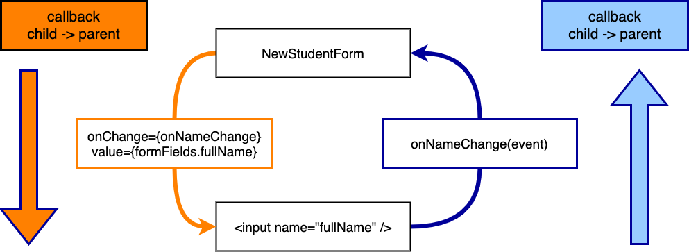
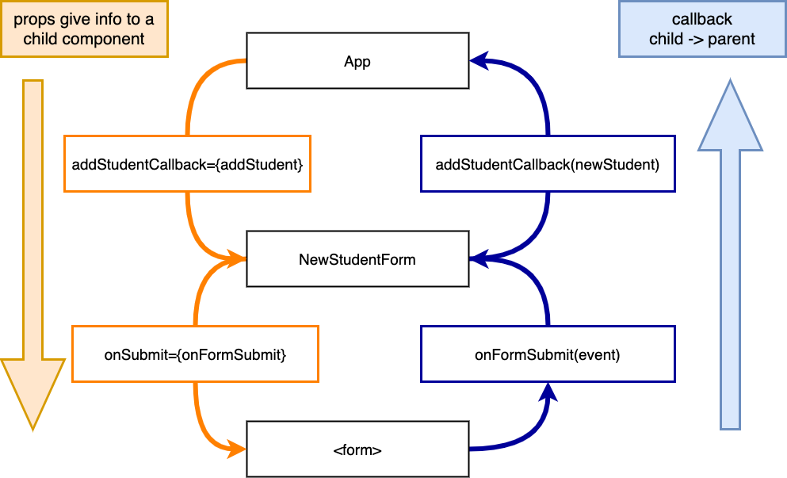

# React Forms

## Learning Goals

- Differentiate between _controlled_ and _uncontrolled_ forms
- Implement a controlled form as a React component
- Handle the event of a form submission

## Overview

Since we've already learn how event handling works in React, we should be able to take the application of this knowledge one step further to allow us to submit a set of form data. Forms work a bit different than other HTML elements because they maintain some of their own state.

Additionally, one of the most powerful aspects of using any JavaScript framework is to provide some dynamic user interaction. We'll see here how to integrate ongoing user feedback, so the user does not have to wait until the form is submitted to know that they might have issues with the data.

### Controlled Forms

The way React handles forms is a little different than the way they're handled in vanilla JavaScript. To understand how it's different, let's remember how forms work so far. Here is the pattern for an **uncontrolled** form:

1. User types at the keyboard
1. Browser notices the typing, updates the value of the `<input>` element
1. When the form is submitted, a JavaScript event handler reads the `<input>` elements and does something with the data

We let the browser do its thing until the form is submitted - that's why it's called uncontrolled. In contrast, in a React form the JavaScript comes in a little earlier. We say that React forms are **controlled** because our JavaScript program controls what data is in the form.

1. User types at the keyboard
1. A JavaScript event handler updates our program's state
1. Our program re-renders the `<input>` element with the updated value

To summarize, in a controlled form our JavaScript has the data and gives it to the DOM, whereas in an uncontrolled form the DOM has the data and our JavaScript has to ask for it. We say that our program is the _source of truth_ about what's in the form. If you needed to find out what the form said, you would ask our program rather than looking at the DOM.


| Uncontrolled Form          | Controlled Form                        |
| -------------------------- | -------------------------------------- |
| Vanilla JS / jQuery        | React                                  |
| DOM is the source of truth | Component state is the source of truth |
| input -> DOM -> JS         | input -> JS -> DOM                     |

One interesting question is, _why bother?_ Well, when the data is stored in your program instead of the DOM, you can do things to it before it appears on the screen. "Do things" might mean validating user input and changing the color of the `<input>`, or only accepting the characters `a` and `d`, or converting everything the user types to CAPITAL LETTERS. The possibilities are endless!

In React, we'll be building our controlled form as a component. Looking at the steps above, our component will need:
- A piece of `state` to store the _value_ of each `<input>` element
- An event handler that fires whenever one of the inputs _changes_, to update the state
- An event handler for when the form is _submitted_, to do something with the final data

Let's get to it!

## Building a Controlled Form

### Start with an Uncontrolled Form

We'll start by building an _uncontrolled_ form as a React component, then convert it to a _controlled_ form later. A normal HTML form to add a student to a list might look like this:

```html
<form id="new-student" >
  <label for="fullName">Student Name</label>
  <input name="fullName" type="text">
  <label for="email">Student Email</label>
  <input name="email" type="text">
  <input type="submit" value="Add Student">
</form>
```

Let's wrap it in a React component.

```javascript
iimport React, { useState } from 'react';
import './NewStudentForm.css';


const NewStudentForm = (props) => {

  return (
    <form className="new-student-form">
      <div>
        <label htmlFor="fullName">Name:</label>
        <input name="fullName" />
      </div>
      <div>
        <label htmlFor="email">Email:</label>
        <input name="email" />
      </div>
      <input
        type="submit"
        value="Add Student"
      />
    </form>
  );
}

export default NewStudentForm;
```

This is still an uncontrolled form - it just happens to be a React component. It functions just like the HTML form, with the DOM is maintaining the values of the `fullName` and `email` fields.

We can also add it to the `App` component to see it render:

```javascript
// src/App.js
// ...
return (
    <div className="App">
      <StudentCollection students={studentList} onUpdateStudent={updateStudent} />
      <NewStudentForm />
    </div>
  );
```

### Making it Controlled

Now that our form is in a React component we can convert it to a controlled form. Our first step is track `fullName` and `email` in state.

```javascript
//  src/components/NewStudentForm.js
// ...
const [formFields, setFormFields] = useState({
    fullName: '',
    email: '',
  });
```

The `NewStudentForm` component will track the `fullName` and `email` as part of it's state.

We can then manage the input fields by setting their value to match the `NewStudentForm`'s state and adding an event handler to respond to changes in the input value.

To link changes in the input field to the `NewStudentForm`'s state we can add an event handler.  So when the input field is edited by the user the event handler function is called which updates the state.

```javascript
//  NewStudentForm.js
// ...
  // event handlers
  const onNameChange = (event) => {
    console.log(`Name Field updated ${ event.target.value }`);
    setFormFields({
      ...formFields,
      fullName: event.target.value,
    });
  };
```

**Question:** What sort of thing is `event`? What is `event.target`? What about `event.target.value`?

Then add `onChange` and `value` fields to the `input` in `render`.

```javascript
// src/components/NewStudentForm.js
// ...
// In the render method...
<input
  name="fullName"
  onChange={onNameChange}
  value={formFields.fullName}
  name="fullName"
/>
```

Now every time the user types into the name input field the `NewStudentForm`'s state is updated.



<!-- https://drive.google.com/open?id=13TsICZwAWRk9865PrwQ61uPw1X48Ep0v -->

**Practice**:  Update the email field to have the `NewStudentForm` component manage it's state as well.

**Question** Why would it be useful to track the state of a form field?

## Handling Submissions

### Event Handler

Now we want to handle when the user submits the form.  We can add a function as an event handler.

```javascript
// src/components/NewStudentForm.js
// ...
const onFormSubmit = (event) => {
  // prevent the browser from trying to submit the form.
  event.preventDefault();

  // ... We need to add the student to the list.
  setFormFields({
    fullName: '',
    email: '',
  });
};
```

Notice that we never have to read directly from the form with JavaScript.  That's the whole point of a controlled component: we will _never_ read the DOM directly. Instead we look to the component's state for the data.

**Question:** What happens if we omit the call to `event.preventDefault()`?

**Question:** What does the call to `setFormFields` in our event handler do?  Why did we include it?

We can cause our `onFormSubmit` function to be called whenever the form submits by updatting the `render` function by adding an `onSubmit` attribute to the `form` element.

```javascript
// src/components/NewStudentForm.js
// ...
<form className="new-student-form" onSubmit={onFormSubmit}>
// ...
```

### Callback Function

Now we have a way to detect submit events on the form, but no way to get data to the rest of the application. To solve this we will follow the same strategy we used for event handling previously:

- Add a function to `App` that modifies state (this time by creating a new student)
- Pass that function as a prop to `StudentCollection` and have `StudentCollection` forward the function to `NewStudentForm`
- Call the function when the form is submitted

When we're done, our event handling structure will look like this:



<!-- https://drive.google.com/file/d/1jagE5V-XT2t81lWNkUviUROTltw6xmjU/view?usp=sharing -->

Does this diagram look familiar? It should!

Our first step is to add a callback function to `App` and pass that function to `NewStudentForm` as a prop.

```javascript
// src/App.js
...
// callback function to add students to the list

const addStudent = (student) => {
  // Duplicate the student list.
  const newStudentList = [...students];

  // Find the max id and add 1
  const nextId = Math.max(...newStudentList.map(student => student.id)) + 1

  newStudentList.push({
    id: nextId,
    fullName: student.fullName,
    email: student.email,
    present: false,
  });

  setStudentList(newStudentList);
}
```

Then we can update the `onFormSubmit` function.

```javascript
// NewStudentForm.js
// ...
  const onFormSubmit = (event) => {
    event.preventDefault();

    props.addStudentCallback(formFields);

    setFormFields({
      fullName: '',
      email: '',
    });
  };
```

Now when we submit the form, we should see students being added to the list. Good work!

**Question:** How does this compare to the event handling we did earlier in the week?

**Exercise:** Right now, we can add a new student with bogus data, for example a blank name. We'll talk about form validation more in a future lesson, but for now, how would you stop the student from being added without a name?

## Finished product

You can view the finished code on our [Ada example](https://codesandbox.io/s/ada-students-forms-ns6e4).

## Key Takeaway

Forms in a React component can be bound to a component's state which allows it to respond dynamically to changes in the form fields.  React components can also be passed functions as props, which can allow a component to pass information up to it's container.

## Additional Resources

- [React Docs: Forms](https://reactjs.org/docs/forms.html)
- [What is preventDefault()?](https://www.robinwieruch.de/react-preventdefault)
- [An Imperative Guide to Forms in React](https://blog.logrocket.com/an-imperative-guide-to-forms-in-react-927d9670170a)
- [Controlled & Uncontrolled form inputs](https://goshakkk.name/controlled-vs-uncontrolled-inputs-react/)
