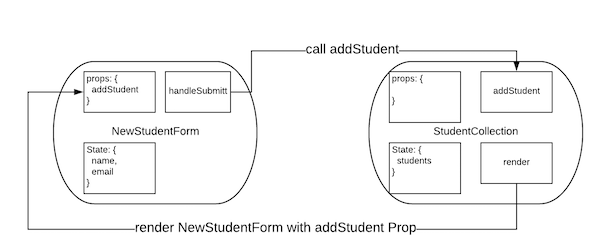

# React Forms

## Learning Goals
- Implement a form in a component
- Dynamically provide user feedback as they complete a form with validations
- Handle the event of a form submission in a component

### Overview
Since we've already learn how event handling works in React, we should be able to take the application of this knowledge one step further to allow us to submit a set of form data. Forms work a bit different than other HTML elements because they maintain some of their own state.

Additionally, one of the most powerful aspects of using any JavaScript framework is to provide some dynamic user interaction. We'll see here how to integrate ongoing user feedback, so the user does not have to wait until the form is submitted to know that they might have issues with the data.

## A Regular HTML Form

A normal HTML form to add a student to a list might look like this:

```html
<form id="new-student" >
  <label for="name">Student Name</label>
  <input name="name" type="text">
  <label for="email">Student Email</label>
  <input name="email" type="text">
  <input type="submit" value="Add Student">
</form>
```

When a user enters text in the form controls the DOM stores the values of the form fields.  However we can do a lot more combining it with React.

First we will build a React component to manage creating new students.

```javascript
import React, { Component } from 'react';
import  './new_student_form.css';

class NewStudentForm extends Component {
  constructor() {
    super();
  }
  render() {
    return (
      <div>
        <form className="new-student-form">
          <div>
            <label htmlFor="name">Name:</label>
            <input name="name" />
          </div>
          <div>
            <label htmlFor="email">Email:</label>
            <input name="email" />
          </div>
          <input className="button success" type="submit" value="Add Student" />
        </form>
      </div>
    );
  }
}

export default NewStudentForm;
```

Now we have a React component to render the form.  It functions just like the HTML form, but can be imported into larger React Components.  Right now the DOM is still maintaining the values of the `name` and `email` fields.  However now that we have them in a React component we can modify the form controls to have React monitor the input fields and handling the form submission.

We can do this by adding `name` and `email` to the `NewStudentForm`'s state in the constructor.

```javascript
//  new_student_form.js
...
constructor() {
  super();

  this.state = {
    name: '',
    email: '',
  }
}
```

The `NewStudentForm` component will track the `name` and `email` as part of it's state.

We can then manage the input fields by setting their value to match the `NewStudentForm`'s state and adding an event handler to respond to changes in the input value.

To link changes in the input field to the `NewStudentForm`'s state we can add an event handler.  So when the input field is edited by the user the event handler function is called which updates the state.

```javascript
  //  new_student_form.js
  onNameChange = (event) => {
    console.log(`Name Field updated ${event.target.value}`)
    this.setState({
      name: event.target.value,
    });
  }
```

Then add `onChange` and `value` fields to the `input` in `render`.

```javascript
<input
  onChange={ this.onNameChange }
  value={ this.state.name }
  name="name"
/>
```

Now every time the user types into the name input field the `NewStudentForm`'s state is updated.

**Practice**:  Update the e-mail field to have the `NewStudentForm` component manage it's state as well.

**Question** Why would it be useful to track the state of a form field?


## Form Validation

By allowing the `NewStudentForm` component track the status of the form fields this will allow us to:
- Validate form fields on the fly
- More easily access the form fields when the form is submitted.

We can perform a validation on the email field with a function like this:

```javascript
emailValid = () => {
  return this.state.email.match(/\S+@\S+/);
}
```

And give the user feedback on validation with:

```javascript
<input
  onChange={ this.handleEmailChange }
  value={ this.state.email }
  className={ this.emailValid() ? "valid": "invalid" }
  name="email"
/>
```

**Question:**  What does this line with `className=` do?

The form is rerendered every time the state of the component changes, and this code will run `this.emailValid()` and if the email field is valid the input will have a class of `valid`, and if not it will have the class of `invalid`.  With a little CSS we can give the user valuable feedback as to the status of a form field.

```css
.valid {
  background: lightgreen;
}

.invalid {
  background: pink;
}
```

So with our form we can track input into the fields and provide real-time validation feedback.  Next we want to actually **do** something with the data, but our `NewStudentForm` component doesn't, and shouldn't need to care what happens with the submitted data.

**Question**:  Looking at our Ada student list app to date, what component would be managing the student data?

## Handling Submissions

Now we want to handle when the user submits the form.  We can add a function as an event handler.

```javascript
// new_student_form.js
...
handleFormSubmit = (event) => {
  event.preventDefault();
  const newStudent = {
    name: this.state.name,
    email: this.state.email,
  };

  this.setState({
    name: '',
    email: '',
  });

  // Now we need to do something with the student...
}
```

**Question**:  With your SeatSquat partner answer the following.  Why do we have the call to `this.setState` in our event handler?  Why would we need this?

We can cause our `handleFormSubmit` function to be called whenever the form submits by updatting the `render` function by adding an `onSubmit` attribute to the `form` element.

```javascript
// new_student_form.js
...
<form className="new-student-form" onSubmit={this.handleFormSubmit}>
...
```

Now we have a way to detect submit events on the form, but no way to get data to the rest of the application.  To solve this we will modify the `StudentCollection` component to pass a function as a prop to the `NewStudentForm` so it can pass the student data back.



First adding a callback function to `StudentCollection` and passing that function to `NewStudentForm` as a prop.

```javascript
// student_collection.js
...
// callback function to add students to the list
addStudent = (student) => {
    const students = this.state.students;

    students.push(student);
    this.setState({
      students
    });
  }

render() {
  let studentComponents = this.state.students.map(function(student) {
    return <Student key={ student.name } name={ student.name } email={ student.email }/>
  });

  return (
    <div>
      <h3>Students</h3>
      { studentComponents }
      <NewStudentForm addStudent={this.addStudent} />
    </div>
  )
}
...
```

Then we can update the `handleFormSubmit` function.

```javascript
// new_student_form.js
...
handleFormSubmit = (event) => {
  event.preventDefault();
  const newStudent = {
    name: this.state.name,
    email: this.state.email,
  };

  this.setState({
    name: '',
    email: '',
  });

  this.props.addStudent(student);
}
```

Now if we test the app we should now be able to add students to the list.  However there are some issues.
1.  We can add students with no names
2.  We can add students with invalid email addresses

**Exercise**  Update the app to prevent form submission if the name is blank, or the email field is invalid.  Think about this as a jQuery application, what HTML element would you attach an event listener to in order to respond to submissions of the form?


## Vocabulary
| Term     | Definition     |
| :------------- | :------------- |
| **Controlled Components**       | Components whos state is managed by a React component.       |
| **Uncontrolled Components**   |  Components who have their state stored in the DOM. |


## Key Takeaway

Forms in a React component can be bound to a component's state which allows it to respond dynamically to changes in the form fields.  React components can also be passed functions as props, which can allow a component to pass information up to it's container.  


## Additional Resources
- [React Docs: Forms](https://reactjs.org/docs/forms.html)
- [An Imperative Guide to Forms in React](https://blog.logrocket.com/an-imperative-guide-to-forms-in-react-927d9670170a)
