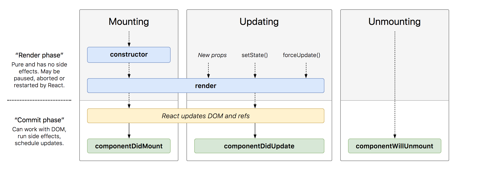
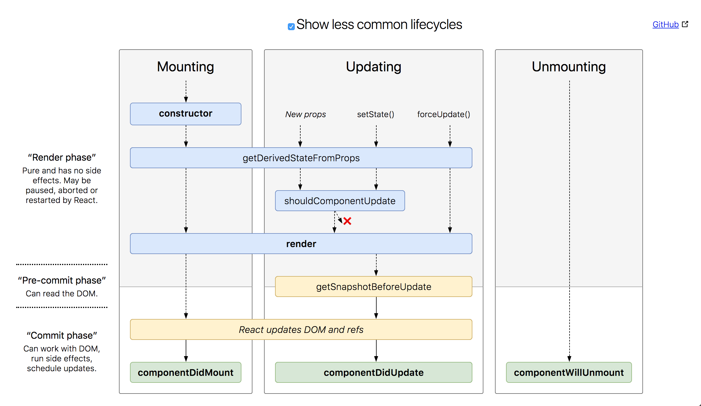

# Lifecycle Methods

## Learning Goals
- Learn about the three phases: mount, update and unmount
- Learn each method within the three phases
- Practice utilizing a few common lifecycle methods in a React app

### Overview
React provides us with methods tied into the lifecycle of each component we use. We can use these to fully control what happens when each small portion of our application renders, before the component renders, after the component renders and once it has disappeared altogether.   


[Source: Interactive Documentation + Diagram](http://projects.wojtekmaj.pl/react-lifecycle-methods-diagram/)

### Methods within each phase

Overall Phase | Description
:------------ | :-----------
Mount | Initial component creation
Update | After a component is created, these methods will be called when React believes a component will be updated
Unmount | When your application no longer needs the component

The above diagram shows the common lifecycle methods and how they flow with one another, but let's see another diagram that will describe the current lifecycle methods as of April 2018.


[Source: Interactive Documentation + Diagram](http://projects.wojtekmaj.pl/react-lifecycle-methods-diagram/)

### `componentDidMount`
This is one of the most commonly used lifecycle methods in React, so we are going to explicitly try this out. We use this method to load in any external data from an API that we might need.

Though we aren't yet integrating with any APIs, let's add this method and some corresponding data retrieval within our student management application.

First, let's ask ourselves, **where is the data populated in our application?**

We'll find the initial state set in the `constructor` of our `StudentCollection` component. Let's remove this data, and instead use the `componentDidMount` lifecycle method to load in our data.

```javascript
// student_collection.js
...

constructor() {
  super();

  // now just set to default empty array
  this.state = { students: [] }
}

componentDidMount() {
  this.setState({ students: fetchStudents() }));
}

...

// this is just a placeholder for a real request
// make sure to put this OUTSIDE the component definition
const fetchStudents = () =>
  ([
    { name: "A Student", email: "4321@ada.org" },
    { name: "B Student", email: "1234@ada.org" }
  ]);

```

While this might not seem super useful yet, we'll see when we get to using APIs how we'll leverage the lifecycle to ensure we are loading our app and it's data efficiently.

### Other Methods
Here are brief definitions of other lifecycle methods that React provides.

#### `constructor`
We've already used this one! The constructor for a React component is called before it is mounted. Typically, in React constructors are only used for two purposes:

- Initializing local state by assigning an object to `this.state`
- Binding event handler methods to an instance

#### `componentDidUpdate`
`componentDidUpdate` is invoked immediately after updating occurs. This method is not called for the initial render.

Use this as an opportunity to operate on the DOM when the component has been updated.

#### `componentWillUnmount`
`componentWillUnmount` is invoked immediately before a component is unmounted and destroyed. You should do cleanup in this method, such as cancelling network requests. Once a component instance is unmounted, it will never be mounted again.

---
### Other, Rarer Lifecycle Methods

#### `shouldComponentUpdate`
`shouldComponentUpdate` is invoked before rendering when new props or state are being received. You can override this by hand if you _really need_ to add conditional logic for if a component's output is affected by the current change in state or props. _In most cases_ you will not need to override this, and you can rely on its default behavior.

#### `getDerivedStateFromProps`
`getDerivedStateFromProps` is invoked right before calling the render method, both on the initial mount and on subsequent updates. It enables a component to update its internal state as the result of changes in props.

#### `getSnapshotBeforeUpdate`
`getSnapshotBeforeUpdate` is invoked right before the most recently rendered output is committed to e.g. the DOM. It enables your component to capture some information from the DOM (e.g. scroll position) before it is potentially changed. Any value returned by this lifecycle will be passed as a parameter to componentDidUpdate().

---


## Vocabulary
| Term     | Definition     |
| :------------- | :------------- |
| Lifecycle Method       | A method that we can utilize within a React component which will trigger at certain points of the component lifecycle       |
| Mounting | Triggers when a component renders for the first time |
| Update | Triggers when a component will be updated |
| Unmounting |Triggers when a component will be removed from the DOM |

## Key Takeaway
- To further manage data within your components, you should utilize lifecycle methods in React to tie into the important events for a given component.

## A Note About React Development
As React evolves, changes to the lifecycle methods come and go. For example, a major update was made to the React component lifecycle between the first draft of this lesson and its current draft!

Older documentation, tutorials, diagrams, resources, and advice on the internet may reference lifecycle methods that are now deprecated. It's the developer's responsibility to stay current with their tools. A good way to do that is to always and frequently visit [the official blog](https://reactjs.org/blog) and check against [the official documentation](https://reactjs.org/docs/react-component.html).

## Additional Resources
- [React Lifecycle Methods and When to Use Them](https://engineering.musefind.com/react-lifecycle-methods-how-and-when-to-use-them-2111a1b692b1)
- [React Docs: State and Lifecycle](https://reactjs.org/docs/state-and-lifecycle.html)
- [Official React Blog: Changes to lifecycle in v16.3.0](https://reactjs.org/blog/2018/03/27/update-on-async-rendering.html)
