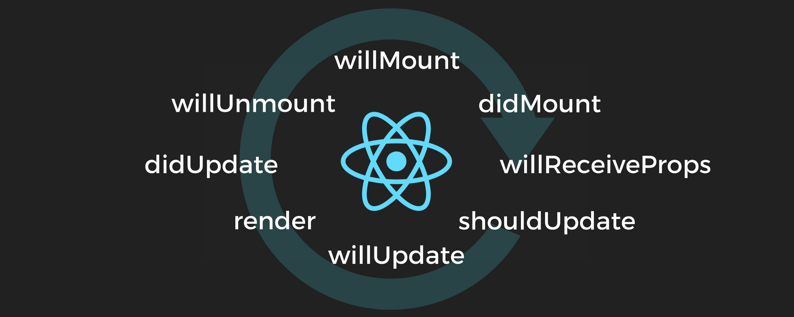
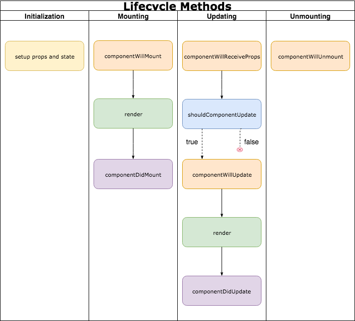

# Lifecycle Methods

## Learning Goals
- Learn about the three phases: mount, update and unmount
- Learn each method within the three phases
- Practice utilizing a few common lifecycle methods in a React app

### Overview
React provides us with methods tied into the lifecycle of each component we use. We can use these to fully control what happens when each small portion of our application renders, before the component renders, after the component renders and once it has disappeared altogether.   

[**Source**: Article Linked in Additional Resources Below]

### Methods within each phase

Overall Phase | Description
:------------ | :-----------
Mount | Initial component creation
Update | After a component is created, these methods will be called when React believes a component will be updated
Unmount | When your application no longer needs the component

The above diagram shows how each lifecycle method exists in flow with one another, but let's see another diagram that will map to the overall phase and show us how `render` also fits in.

<!-- https://drive.google.com/file/d/1hcuLdozEUkJY6mc5cB-xzCqEDIar_SfV/view?usp=sharing -->

## Vocabulary
| Term     | Definition     |
| :------------- | :------------- |
| Lifecycle Method       | A method that we can utilize within a React component which will trigger at certain points of the component lifecycle       |
| Mounting | Triggers when a component renders for the first time |
| Update | Triggers when a component will be updated |
| Unmounting |Triggers when a component will be removed from the DOM |

## Key Takeaway
- To further manage data within your components, you should utilize lifecycle methods in React to tie into the important events for a given component.

## Additional Resources
- [React Lifecycle Methods and When to Use Them](https://engineering.musefind.com/react-lifecycle-methods-how-and-when-to-use-them-2111a1b692b1)
- [React Docs: State and Lifecycle](https://reactjs.org/docs/state-and-lifecycle.html)
