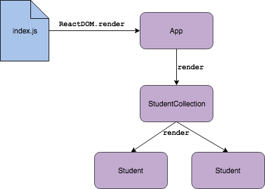

# Event Handling With Nested Components

In this lesson we will return to our `Students` example, to discuss state management and event handling between nested components.

## Learning Goals

By the end of this lesson, students should be able to...

- Render child components from `state`
- Understand when and how to lift state from a child component to a parent component
- Pass event handler functions as callbacks within `props`

## Introduction

Last time we worked on our student tracking application, we used a functional `StudentCollection` component to render a list of `Student`s. The student data came from an array created in the `StudentCollection` component.

Our goal for this lesson is to make the application respond to events from the user. So, let's start with some brainstorming:
- What kind of actions might the user take on individual students?
- What kind of actions might the user take on the list of students?

For this lesson our plan is to use our app to track attendance. Each student will have a button with the text "mark present", which when clicked, will show the student as present.

## Refactor to a Stateful Component

### Lifting State Up

Currently there is no way for us to change the student data. If we want to be able to change whether a student is present, we'll need to keep track of that as state in our application.

**Question:** Where should our application's state live? What are our options?

We could keep the state for each student in the corresponding `Student` component, initializing it from `prop`s in the constructor. For this limited example, that would work fine. However, if we were to add event handling on the whole collection (sort, add/remove, etc.), it would reset all the state on the individual `Student`s! Not so good.

Instead, we will _lift_ the state out of the `Student` component into the `StudentCollection`. This is a very common technique when managing a list of components in React: all the state lives in the parent component. This will also line up well with the code we've already written.

#### Classical Component

Our first step is to refactor the existing `StudentCollection` to be a classical component. The easiest way to do this is to:
- Wrap the existing function in a class declaration
- Rewrite the function signature to match the pattern for `render`
- Replace `props` with `this.props` (find-and-replace is your friend)

When all is said and done, you should have something like this:

```js
// src/components/StudentCollection.js
// ... same import statements ...

class StudentCollection extends React.Component {
  render() {
    // ... exactly what was in the body of the component function before ...
  }
};

export default StudentCollection;
```

Verify that this was a true refactor, in other words that your app still runs and looks exactly the same.

#### Adding State

Our component is now a class, but it still doesn't keep track of any state. Let's fix that.

As we saw in previous lessons, `state` should be set initially in the constructor. For our `StudentComponent`'s initial state, we'll use the list of students. We'll add an extra field to our students here, `isPresent`, which we'll be using in a bit.

Set up a constructor in the `StudentCollection` component. Don't forget your call to `super();` which is always required in a component constructor!

```javascript
// src/components/StudentCollection.js
constructor() {
  super();

  this.state = {
    students: [
      {
        fullName: "Ada Lovelace",
        email: "ada@lovelace.uk",
        isPresent: false
      },
      {
        fullName: "Katherine Johnson",
        email: "kat@nasa.gov",
        isPresent: false
      }
    ]
  }
}
```

Next, we'll use a `map` in our `render` function to iterate through each item in our state object and render a `Student` component for each piece of data. You should already have some of this `map` logic, but now we'll be getting the data from `state` rather than a constant.

```javascript
// src/components/StudentCollection.js
render() {
    const studentComponents = this.state.students.map((student, i) => {
      return (
        <li key={ i }>
          <Student
            index={ i }
            fullName={ student.fullName }
            email={ student.email }
            isPresent={ student.isPresent }
            />
        </li>
      );
    });

    return (
      <div>
        <h3>Students</h3>
        <section>
          { studentComponents }
        </section>
      </div>
    );
  }
```

Verify that you now see the data from the `state` variable in your browser.

Now let's take a look at an updated version of the diagram that we created in our last component creation lecture:


<!-- https://drive.google.com/open?id=1xq5jaCrI7FGp6PG1gr-bYE1ZTvPb5PxZ -->

Note that we're passing in a new `isPresent` prop here. How could we modify our `Student` component to reflect this information?

## Modify `state` using an event
Listing out our students is great, but what if we could also track attendance? Let's do it! We'll set up a button for each student. When pressed, this button will update the `state` data for that student to mark them as "present". Additionally, we'll add some CSS so that students who have been marked "present" will be identified to the user.

There are a few things to consider when making this change to our application. Think about these questions with your seat squad.
1. Which component should contain the button that will enable us to mark an individual student as "present"?
2. Which component is managing the student data?
3. Is the answer to #1 the same as #2?

If you answered NO to question #3, you're on to something big. The data related to the students is tracked in the `StudentCollection` while the button to mark an individual student "present" should really be on each individual `Student` component. Our challenge then is to use the tools we have been given to _propagate_ the button press event from one component to another.

#### The button
Let's start by updating the `render` function of the `Student` component to include the `isPresent` property, and a button.

```js
<p>
  { this.props.isPresent ? 'Present' : 'Absent' } today
  <button
    disabled={ this.props.isPresent }
    >Mark Present</button>
</p>
```

Change the initial state in the `StudentCollection` to verify this works as intended.

#### The Event Handler
Next, let's explore the event handler setup. What data do we need from the button click event to appropriately change the overall student's state?

Create the event handler function with an initial logging statement to get us started. We'll follow the same pattern as before for a DOM event handler: start with `on`, then indicate what element and what event are being handled.

```javascript
// Student.js

onPresentButtonClick = () => {
  console.log(this);
}
```

Then we tie the button to the event handler function:

```javascript
// Student.js

<button
  disabled={ this.props.isPresent }
  onClick={ this.onPresentButtonClick }
  >Mark Present</button>
```

Test it out and see what gets logged in the console. What piece of data is going to help us determine exactly which student should be updated?

#### Callback from the Parent

Next, we must consider that the `state` of the students is not stored within this component. In order to update this, we'll need to call some code within the `StudentCollection` component which will change the state.

Let's create a new event handler function in the `StudentCollection` component. This even handler should take in one parameter which represents the unique identifier for the given student whom we want to mark "present".

```javascript
//StudentCollection.js

markPresent = (studentIndex) => {
  console.log(studentIndex);
}
```

**Question:**  What way do we have to pass data from a parent component to a child component.

If you answered `props` you're correct!

We are going to send _a callback function_ as `props` from the `StudentCollection` component to the `Student` component. Once the event occurs in the child component, we can then get the data we need from the child, and pass that to the parent to update the `state`.

Update the `render` function in the `StudentCollection` component to pass in a new `prop` to `Student`, the callback function. Note: We are passing this as a function not _calling_ the function, so we leave the parenthesis off.

```javascript
// StudentCollection.js
this.state.students.map((student, index) => {
  return (
    <li key={ i }>
      <Student
        index={ i }
        fullName={ student.fullName }
        email={ student.email }
        isPresent={ student.isPresent }
        markPresentCallback={ this.markPresent }
        />
    </li>
  );
});
```

Now, in the `Student` component, we can call this callback function within our event handler with the information about the specific student that needs to be updated.

```javascript
// Student.js

onPresentButtonClick = () => {
  console.log(this);
  this.props.markPresentCallback(this.props.index);
}
```

Finally, we'll update the callback function in the parent component to modify the state of the student.

```javascript
//StudentCollection.js

markPresent = (studentIndex) => {
  console.log(studentIndex);

  // Store our state in a local variable so we can make the update
  let updatedStudents = this.state.students;
  updatedStudents[studentIndex].present = true;

  // Call setState to update our state (as well as re-render automatically)
  this.setState({ students: updatedStudents });
}
```

### Event Handling Summary

Wow, that was kind of complex. Let's look at a diagram of what's going on.


<!-- https://drive.google.com/open?id=1byKvDyUP5HUwQojmg2cpL4eNO9keFYpD -->

**On the left in orange** is the setup. Information is passed from parent components to child components at `render` time using `props`.
- `StudentCollection` gives `Student`:
  - Its position in the array (`index`)
  - A callback function to invoke when it is marked present (`markPresentCallback`)
  - Some info about itself (`fullName`, `email`, `isPresent`)
- `Student` gives its `<button>` a callback function to invoke when the button is clicked

**On the right in blue** is the sequence that happens when the `<button>` is clicked.
- The button invokes its callback, `onPresentButtonClick`
- `onPresentButtonClick` takes the index from the `Student`'s `props`, and uses it to invoke `markPresentCallback`

`markPresentCallback` comes from `markPresent` in the `StudentCollection`
- Invoking this function updates the state of `StudentCollection`
  - It uses the index that was passed in and updates the corresponding student record
- Updating state causes `StudentCollection` to re-render
- When `StudentCollection` re-renders, it will pass the new value for `isPresent` to the `Student`, causing that `Student` to re-render

This style of event handling is very common in React - it comes up whenever an event on a child component needs to update state stored in a parent component. Having a good handle on how the pieces fit together will be especially helpful once we talk about forms later.

## Key Takeaway
Once we have a grasp on how to use `props` and `state` within our React application, the possibilities are endless. Using these concepts to manage the data and our understand of how to nest components, we can create rich and interactive applications.

## Additional Resources

- [React Docs: Lifting State Up](https://reactjs.org/docs/lifting-state-up.html)
