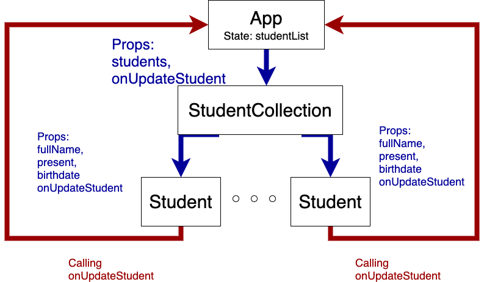
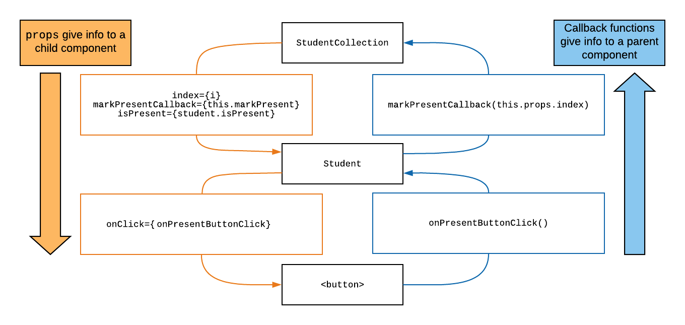

# Event Handling With Nested Components

In this lesson we will return to our `Students` example, to discuss state management and event handling between nested components.

## Learning Goals

By the end of this lesson, students should be able to...

- Render child components from `state`
- Understand when and how to lift state from a child component to a parent component
- Pass event handler functions as callbacks within `props`

## Introduction

Last time we worked on our student tracking application, we used a functional `StudentCollection` component to render a list of `Student`s. The student data came from an array created in the `StudentCollection` component.

We modified the `Student` component to respond to events to mark a student present or absent and to update that student's name, maintaining it's own state.

Our goal for this lesson is to move the state up to the `App` component and return the `Student` component to a stateless component.  

Why might we want to do this:

- It makes the `Student` component easier to test and read
- If we later have the `App` component getting students from an external source (an API or file) it can manage the data and external sources and let the `Student` components focus on display and event handling.
- It allows us to separate concerns, the `App` component handles the data and the `Student` and `StudentCollection` components handle the display.

Our finished app will be structured like this:



<!-- original file https://drive.google.com/file/d/1kot6UWXwSEMwjSLFIO2elzWOjCgKb6n8/view -->

### Lifting State Up

Currently there is no way for App to see the state of all student data.  So if at a later point we wanted to save changes to our student data into an API or other external data source, App does not have visibility into the internal state of each `Student` component.  So, we are going to save the student data as state inside the `App` component and return `Student` to a functional stateless component just using props.

This would also let us later do things like reorder, sort or remove students.

**Question:** Currently why can't the `App` component see the current present or absent status of a student?

<details>
<summary>Our Answer</summary>

Because _state_ is internal to the component, parent components have no visibility into it.  They can only see the props that they pass in. 

Instead, we will _lift_ the state out of the `Student` component into the `App` component. This is a very common technique when managing a list of components in React: all the state lives in a parent component.
</details>

#### Adding State to App

We will begin by modifying App to store the student list in state.  First import `useState` from react.

```javascript
import React, { useState } from 'react';
```

Then in the App component we can call `useState` and send the students array as props to `StudentCollection`.

```javascript
function App () {
  const [studentList, setStudentList] = useState(students);

  return (
    <div className="App">
      <StudentCollection students={studentList} />
    </div>
  );
}
```

We can now verify that the app still works as normal.  

We can also add a function to change a student.  In addition, to make things easier we can add an `id` field to each student object.

```javascript
// src/App.js
// ...

const students = [
  {
    id: 1,
    fullName: "Ada Lovelace",
    email: "ada@lovelace.uk",
    present: true,
  },
  {
    id: 2,
    fullName: "Katherine Johnson",
    email: "kat@nasa.gov",
    present: false,
  },
];

function App () {
  const [studentList, setStudentList] = useState(students);

  const updateStudent = (updatedStudent) => {
    const students = [];

    studentList.forEach((student) => {
      if (student.id === updatedStudent.id) {
        students.push(updatedStudent);
      } else {
        students.push(student);
      }
    });

    setStudentList(students);
  }
  
  return (
    <div className="App">
      <StudentCollection students={studentList} onUpdateStudent={updateStudent} />
    </div>
  );
}
```

**Question**:  The `updateStudent` function creates a new array to pass in when it calls `setStudentList`?  Why?  What happens when you only modify the correct element of `studentList`?

<details>
  <summary>Our answer</summary>

  The `setStudentList` method checks to see if the new state is different from the old state, but it doesn't look very carefully.  With objects and arrays React only checks to see if the memory address changed.  Is this varaible referencing the same address as the prior state, if so, it doesn't bother to re-render the component. 

  Therefore you need to pass in a new object to update state.  If you do not... the component will not be re-rendered.
</details>

### Removing State from Student

**Question:** Now that App has the student list in state.  What pieces of state still need to be kept inside of the `Student` component?

<details>
  <summary>Answer</summary>

  Actually, none! While we _could_ make a working app that uses a stateful `Student` and `App` components, it will be cleaner to read and update in the future if we turn the stateful version of `Student` back into a stateless component!
</details>

We can now remove `useState` from the `Student` component and return all references to the state variables into props.

Ultimately, we can refactor the code to look like this:

```javascript
// src/components/Student.js
// ...
const Student = (props) => {

  // Event callback functions
  const onButtonClick = () => {
    // Updated below
  }

  const onFullNameInputChange = (event) => {
    // Updated below
  };

  // Component functions always return JSX
  return (
    <div>
      <h3>{props.fullName}</h3>
      <input value={props.fullName} onChange={onFullNameInputChange} />
      <ul>
        <li>Class: C13</li>
        <li>Birthday: {props.birthday}</li>
        <li>Email: {props.email}</li>
      </ul>
      <button onClick={onButtonClick}>
        Mark {props.present ? 'Absent' : 'Present'}
      </button>
    </div>
  );
};
```

## Prop callback functions

So now our Student component gets information from `App` and `StudentCollection`, but still needs to tell `App` when to change this particular student.  Additionally, we'll add some CSS so that students who have been marked "present" will be identified to the user.

There are a few things to consider when making this change to our application. Think about these questions with your neighbors.

1. Which component should contain the button that will enable us to mark an individual student as "present"?
2. Which component is managing the student data?
3. Is the answer to #1 the same as #2?

<details>
  <summary>Answer</summary>
  If you answered NO to question #3, you're on to something big. The data related to the students is tracked in `App` while the button to mark an individual student "present" should really be on each individual `Student` component. Our challenge then is to use the tools we have been given to _propagate_ the button press event from one component to another.
</details>


#### The Event Handler

Next, let's explore the event handler setup. What data do we need from the button click event to appropriately change the overall student's state?

1. An Event Handler in the `Student.js` file, we can use `onButtonClick` and `onFullNameInputChange`.
1. A function that has access to the state inside of `App.js`.

First we will modify the `onButtonClick` as follows.

```javascript
const onButtonClick = () => {
    const updatedStudent = {
      fullName: props.fullName,
      birthday: props.birthday,
      email: props.email,
      // Toggle present to a new value
      present: !props.present,
      id: props.id,
    }

    // call the function passed from `App`
    props.onUpdateStudent(updatedStudent);
  }
```

**Wait** What is `props.onUpdateStudent`?  Take a look at your code and try to walk through what is happening.

<details>
  <summary>Our walkthrough</summary>

  1.  Remember that we added a function `updateStudent` to the `App` component.  This function updates the student list.
  2.  Then we passed the function into `StudentCollection` component as a prop with:  `<StudentCollection students={studentList} onUpdateStudent={updateStudent} />`
  3.  The `StudentCollection` component forwards that prop to each student component with 
```javascript
<Student
  fullName={student.fullName}
  email={student.email}
  present={student.present}
  id={student.id}
  onUpdateStudent={props.onUpdateStudent}
/>
```

This workflow is shown in the image below.

</details>

**Question:** Once we call `onUpdateStudent`, execution will be passed back to the `App` component. What piece of data is going to help the `App` component determine exactly which student should be updated?

<details>
<summary>Answer</summary>
The student we are interested in updating is something we can match using `props.id`. 
</details>

**Question:** Wait, why does this work at all? Shouldn't we lose access to `props` in the onButtonClick function due to scope?

<details>
<summary>Answer</summary>
`onButtonClick` is closed around `props`, so the `props` variable is still accessible! Remember, all we need to close is three things:

1. Nest a function inside a function
2. Reference a variable from the outer function in the inner function
3. Make the inner function available outside the outer function

So in our code we have:

1. `onButtonClick` is nested inside of `Student`
1. We reference `props` inside of `onButtonClick`
1. We hand `onButtonClick` to the `<button>`, where it lives on after `Student` has finished running!

Hey this is a closure!
</details>

#### The CSS

Lastly we can add some CSS and class names to our component by adding the following to our `Student.css`:

```css
/*Student.css*/
.student .absent {
  color: red;
}

.student .present {
  color: green;
}
```

#### Adding className for styling

Next, let's modify the `Student` component to use the `present` property, to style the component.

```javascript
// src/components/Student.js
 // ...
    <div className="student">
      <h3 className={props.present ? 'present' : 'absent'}>{props.fullName}</h3>
 // ...
```

Change the initial state in the `App` to verify this works as intended.  Now the student's name should be styled differently depending on their attendance status.  Try toggling the buttons.


### Event Handling Summary

Wow, that was kind of complex. Let's look at a diagram of what's going on.



<!-- https://drive.google.com/file/d/1dyNbUUe_6rkrSEG_lPKJGiwAAOGIHQ5_/view?usp=sharing -->

**On the left in orange** is the setup. Information is passed from parent components to child components at `render` time using `props`.

- `App` provides a list of students to `StudentCollection`
- `StudentCollection` gives `Student`:
  - It's id in the array
  - It's fullName, birthdate and attendance status
  - A callback function to invoke when it is marked present (`onUpdateStudent`)
- `Student` gives its `<button>` a callback function to invoke when the button is clicked

**On the right in blue** is the sequence that happens when the `<button>` is clicked.
- The button invokes its callback, `onButtonClick`
- `onButtonClick` takes the `Student`'s `props`, and uses it to invoke `onUpdateStudent`
`onUpdateStudent` comes from `updateStudent` in the `App` component
- Invoking this function updates the state of `App`
  - It uses the id that was passed in and updates the corresponding student record
- Updating state causes `App` to re-render
- When `App` re-renders, it will pass the new value for `isPresent` through `StudentCollection` to the `Student`, causing that `Student` to re-render

This style of event handling is very common in React - it comes up whenever an event on a child component needs to update state stored in a parent component. Having a good handle on how the pieces fit together will be especially helpful once we talk about forms later.

### Exercise

Now add functionality to the `Student` component to change the `fullName` field when the input changes.

If you get stuck you can see a finished and working version on [code sandbox](https://codesandbox.io/s/ada-students-nested-components-with-state-nv7l0).

## Key Takeaway

Once we have a grasp on how to use `props` and `state` within our React application, the possibilities are endless. Using these concepts to manage the data and our understand of how to nest components, we can create rich and interactive applications.

## Additional Resources

- [React Docs: Lifting State Up](https://reactjs.org/docs/lifting-state-up.html)
