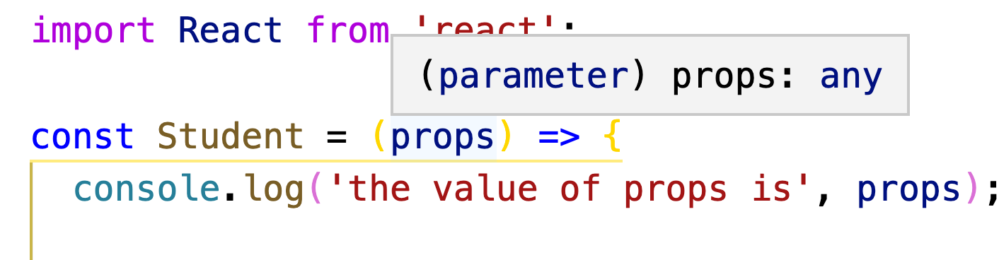

# Prop Types

## Learning Goals
By the end of this lesson you should be able to:

- Explain the use of `PropTypes`
- Use `PropTypes` to define and document the props a component can take

You may have noticed this message from your JavaScript linter.  "____ is missing from props validation (react/prop-types)."  The linter is encouraging you to use a feature of React called PropTypes in which you list the props a component takes and their types.



In this lesson we will define `propTypes` in our React components which will provide some type-checking and documentation of our React component props.

## Student Component Example

Our Student component takes a name & an e-mail as props.  We can define the properties our `Student` component takes by adding a `static` `propTypes` attribute.

First you need to `import PropTypes from 'prop-types';` to import the package.  Then add a static `propTypes` attribute to your component, by making it an additional property to the function.

```javascript
const Student = (props) => {
  // Component functions always return JSX
  return (
    <div>
      <h3>
        {props.fullName}
      </h3>
      <p>{props.email}</p>
    </div>
  );
};

Student.propTypes = {
  fullName: PropTypes.string.isRequired,
  email: PropTypes.string,
};
```

Wait a second - what's with that syntax? We just attached an attribute (`propTypes`) to a function (`Student`). Since functions are first-class objects in JavaScript, this is a totally valid thing to do. It even has a name: `propTypes` is a "static attribute" of `Student`.

The above block defines two props. They both must be Strings. `email` is optional, but `fullName` is required to use a `Student` component. If you try to use the `Student` component without a `fullName` prop you will get this error message:


If a component has optional props you can simply leave off the `isRequired` attribute.

**Exercise** Add another prop to the `Student` component called `age`.  This component should be _optional_.  Update the `Student` class' `propTypes`.

**Question**:  Why encourage developers to list the props the component takes like this?

## Advantages of PropTypes

By adding `propTypes` to your React component classes you gain two things.  First you document the props that your component can and must take.  This makes it much easier for another developer to use your component in another application.  Second `propTypes` helps React engage in type-checking, making sure the proper props are passed to a component along with their correct types.  If a component is missing a prop or the wrong type is passed, React will generate a helpful error message.

## Default Prop Values

You can also set default values for some or all of your props with a `defaultProps` static attribute.

```javascript
Student.defaultProps = {
  email: 'no email on file',
}
```

A `defaultProp` attribute like above ensures that every time the given props have values, even if they are not provided.

## List of PropTypes

|  **Data Type** | **Description**
|---|---
|  `string` | A String
|  `array` | An Array
|  `func` | A function
|  `number` | Any numeric value
|  `object` | A JavaScript object
|  `node` | Anything that can be directly rendered on the screen, numbers, strings, React elements or an array containing these types.
|  `element` | A React element like ``
|  `instanceOf`  | An instance of a given class.  So `person: PropTypes.instanceOf(Student)` would define a prop as an instance of the `Student` class.
|  `oneOf` |  Ensures that the prop is one of a list of specific values.  For example `fullName: PropTypes.oneOf(['Harry', 'Ron', 'Hermine'])` ensures that the fullName prop can only be one of the given values.
|  `oneOfType` |  Ensures that the prop is one of a list of specific types.  For example `fullName: PropTypes.oneOfType([PropTypes.string, PropTypes.number)` ensures that the fullName prop can only be a string or number.
|  `arrayOf` | An array of a specific type, for example:  `ages: PropTypes.arrayOf(PropTypes.number)` would only accept an array of numbers.
|  `objectOf` | An object with fields who's values can only be a specific type:  for Example: `courses: PropTypes.objectOf(PropTypes.string),`
|  `shape` |  An object with specific fields and types, for example: `student: PropTypes.shape({fullName: PropTypes.string, age: PropTypes.number})`

You can also create a custom validator which you can look up along with more examples of using `PropTypes` on the [PropTypes github page](https://github.com/facebook/prop-types).

## Key Takeaway
`propTypes` is an attribute you can define in a React component which lists the props the component can take along with their types.  Mismatches or missing props will generate error messages in the browser console.  PropTypes help you document the props a component can take and help prevent the wrong types of props being passed accidentally.

## Resources
- [Why you should use PropTypes in React Native (works for React in general)](https://codeburst.io/why-you-should-use-proptypes-in-react-native-e6f5ef78e7dd)
- [React Documentation: Typechecking with PropTypes](https://www.npmjs.com/package/prop-types)
- [Validating Props easily with React PropTypes](https://codeburst.io/validating-props-easily-with-react-proptypes-96e80208207)
