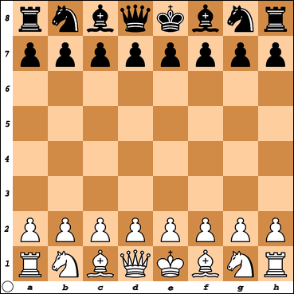
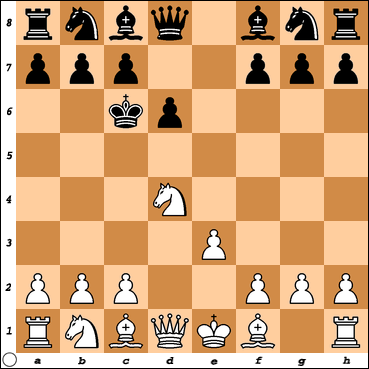

# Intro to State

After this lesson, students will be able to:

- Give a high-level explanation of state as a concept

## State, Generally

State is often a difficult word to define and understand in programming. On the one hand, you might be asked: "how did your program get into this state?" You might reply by showing the stack trace, or walking through code that you know has been run. You could be asked: "What is the state of the variable `x` on the third pass through this `for` loop?" In this case you could answer with the contents of that variable.

State is the word we programmers use to describe the contents of a variable, or set of variables, at a given time. As a definition, the two parts "contents of a variable" and "at a given time" are both important to understanding how we use it.

Let's say we are making a program for playing a game of chess. At the beginning of the game, we always begin with the same state.

If we were defining this "state" for a computer program, we would need to include the colors and positions of each piece, the maximum dimensions of the board, and whether or not either king is in check. 

**Don't worry if you don't know anything about chess. For this lecture, we're just talking pieces and position.**

When we talk about something as "state", like in this game of chess, there is an expectation that things will change. After a few moves, our chess board might look like this:

Each time we move a chess piece, we can say that the 'state' of the board changes. 

In general, state might refer to the contents of our servers, the list of parameters passed into a function, or the contents of an object.

In React, we use the `useState` hook to generate a variable we keep track of through the lifetime of a component.  You can think of it like an instance variable in a Ruby class.  Each instance of the component maintains it's own state over the lifetime of the component.  If we were building a chess game, the locations of each piece and it's type (Queen, King, Bishop etc) could be stored in state.

We'll dive into how we store state in another lecture.
