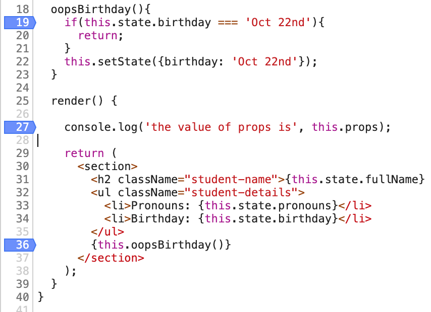

# Managing data using `state`

## Learning Goals
- Examine how React allows components to manage data
- Use `state` within a component
- Examine how `props` and `state` affect component rendering

## `state` vs 'state'

State is something we've been using for a while already. The word refers to any values that are persistent in a program. Objects in Ruby and other object oriented languages track their state using instance variables. Therefore, you can say that the 'state' of an object is a snapshot of all the variables in an object.

State can refer to all of the variables in an app, all of the variables in a database, or all of the variables in an object. So when someone asks you, "How did the object get in this state?", they are asking "How and when did these variables get set?".

In React, there is a special variable for class components called `state`. `state` is an object that belongs to, and manages data **within a given component**.  `state` can be accessed using the `this.state` object and it can be modified using the `this.setState()` function.

#### Overview
- You may populate `state` with any object keys you want
- `setState` takes one parameter that must be an object
- `setState` will merge any new keys passed in with the existing data in `state` 
- `setState` will only overwrite data if you pass it an object that contains keys already within `state`
- We often set the initial state in the constructor function

A really important aspect of state is that whenever the state of a component is changed, it will be **updated**, calling the `render` function. For now, you can think of `setState` as doing the `setState` operation PLUS the `render` _automatically_. We'll learn even more about what else our component does when it is updated later on.

#### Examples

**Syntax**

Commonly, initial state is set in a component's constructor function. This is set using variable assignment (the equals sign).

```javascript
// Student.js
import React from 'react';

class Student extends React.Component {
  constructor(props) {
    super(props);
    this.state = {
      name: props.name,
      class: props.class,
      attendance: props.present,
      birthday: props.birthday
    };
  }

  //Code Omitted
}

export default Student;
```

Once we know that the initial state is set, we can update our code to use this value within our component class. You'll notice that this looks very similar to the way that we might have filled in the information using `props`. 

```javascript
// NameDisplay.js
import React from 'react';

class Student extends React.Component {
  constructor(props) {
    super(props);
    this.state = {
      name: props.name,
      class: props.class,
      pronouns: props.pronouns,
      attendance: props.present,
      birthday: props.birthday
    };
  }

  //Other Code omitted

  render() {
    return (
      <section>
        <h2 className={buildClasses()}>{this.state.fullName}</h2>
        <ul className="student-details">
          <li>Pronouns: {this.state.pronouns}</li>
          <li>Birthday: {this.state.birthday}</li>
        </ul>
      </section>
    );
  }
}

export default Student;
```

## Making Changes

Once the initial state is set, we can then make changes using the `setState` function. (**Reminder:** `setState` will work even if that a variable was not included in the initial `state` object.) This function will merge the object passed in with the existing state object, overriding any existing values on the same variables. `setState` function calls are very often triggered by events that our users can trigger.

We are going to use this in conjunction with **events** later, but for now, we will conduct a little experiment to see how this works.

### Exercise

We are going to take a few minutes to try and understand how `setState` works in React.

1. Create a new method inside your `Student` component that updates some key in the `state`. Make sure that it sets the value to the same thing each time, and make sure that it returns without calling `setState` if the value is already set. It might look like this:

``` javascript
  oopsBirthday(){
    if (this.state.birthday === 'Oct 22nd'){
      return;
    }    
    this.setState({birthday: 'Oct 22nd'});
  }
```

2. We are going to call this method in our `Student` component's `render` function. Ideally, we should be calling it somewhere after we have printed or used the relevant data.

1. Start the application if it isn't already started, and open up the developer tools for your browser. Open up the `Sources` tab, and navigate to the appropriate file. On Chrome, that might look like this: 

1. Once you're here, set some breakpoints, and reload the page to start debugging. Follow the execution. 

If you run into the following error, return to step 1 and fix your code. 

What do you notice about how this plays out? In what order do these calls happen? How does the page itself and the data change as each method finishes?

## Changing `props` and `state`
Now that we have learned about both `props` and `state`, we'll need to consider which concept to use for which scenarios.
Here is a helpful chart to assist you in determining whether data belongs in `props` or `state`. For any line item that has "Yes" for both, it means you need to make that decision based on the context of the problem you are trying to solve.

 ?     | props     | state
 :------------- | :------------- |:-------------
Does the data come from the parent component?       | Yes   | Usually
Do we want the parent component to always decide the value? | Yes | No
Will this data need to change over time? | No | Yes
Do we want to pass this value to a child component? | Yes | Yes
Do we want the child component to manipulate this data? | Yes | No

## Key Takeaway
Using `state` will help you manage data within a React component. Using `props` and `state` together is a powerful way to share and manage data between components. They each have their own purpose, but they can be used together to provide the most dynamic applications.

## Additional Resources
- [React Docs: State and lifecycle](https://reactjs.org/docs/state-and-lifecycle.html)
