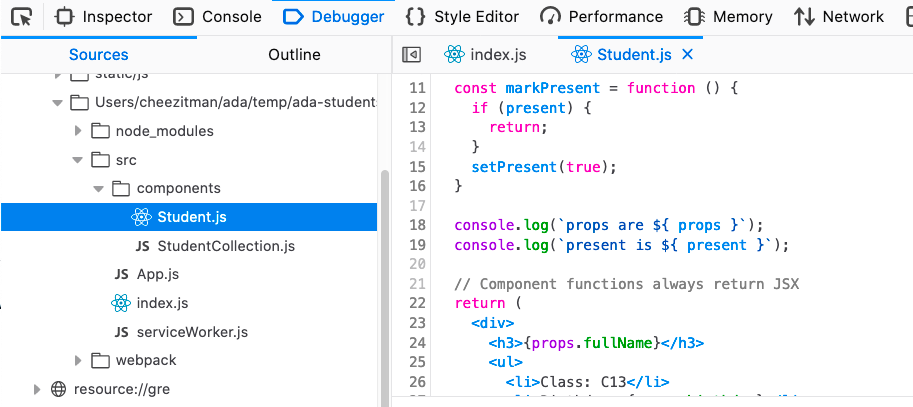
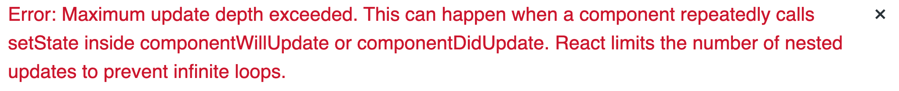
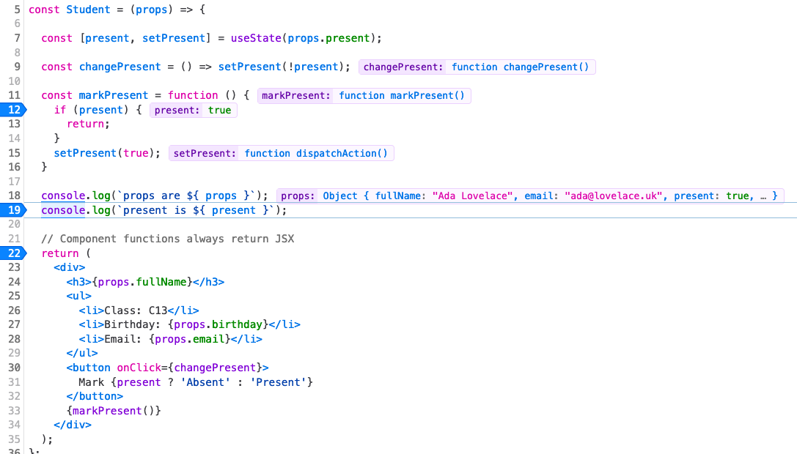

# Managing data using `state`

## Learning Goals

- Examine how React allows components to manage data
- Use `state` within a component
- Examine how `props` and `state` affect component rendering

## `state`

State is managed **within a given component**. State can be accessed using the `useState` hook and it can be modified using the a function that `useState` returns.

**Wait what's a hook?**  A hook is a special function react provides to "hook" into the lifecyle of a React component and access specific functionality.  The `useState` hook function allows us to have a variable with scope beyond the execution of a function. In Ruby, an instance variable served this same purpose.  It also provides a function to change the value of that variable (i.e. it's state).  When this state variable is changed, the component is re-rendered.  React has a number of hooks, and you can even create your own, but for now, we will focus on `useState`.

`useState` allows us to have components with data they remember internally and change over time, like instance variables in a Ruby object.

When we talk about the term _rendering_, we are talking about React calling our functional component and redrawing the content on the screen.

#### useState Overview

- will take the initial value of the state object as a parameter
- will return an array with two elements
  - the current value of the state
  - a function to change the state

## Adding State to the Student Component

Lets say we want each student component to keep track of whether the student is present or absent and we want to be able to change that value if they are present and re-render the component.

### Importing useState

We start by importing the `useState` function.  

```javascript
// src/components/Student.js
import React, { useState } from 'react';
```

**Why do we have { } around `useState`**?

We could call `useState` with `React.useState`, but JavaScript provides a feature called _destructuring_, which we will cover in depth later, which allows us to reference `React.useState` with a variable `useState`, to save typing.

### Calling useState

We can then call `useState` in our Student component.

```javascript
// src/components/Student.js
// ...
const Student = (props) => {

  const [present, setPresent] = useState(false);
  // ...
```

When we called `useState` above we passed in the initial value of the state.  In this example we are defaulting students to being not present (absent).

`useState` returns an array.  We could have written the above as `const presentArray = useState(false)` and then `presentArray[0]` would be the value and `presentArray[1]` would be a function we can use to change the state.
Instead, we are using a feature called destructuring (like we did with the import above) to break that array into two variables `present` and `setPresent`.  This is a common technique when using hooks in React.

Then if we want to change the state of present to `true` we can use the `setPresent` function with the command:  `setPresent(true)`.  This will cause the state variable `present` to change and the Student function to execute again, which is called re-rendering.

In the [next lesson](events.md) we will use this `setPresent` function to change the attendance status of a student when the user clicks a button.

### Adding a button to Student

So right now the Student component has state, but no way for the use to change the state in the browser.  We will add a button to the component as follows:

```javascript
// src/components/Student.js
// ...

const Student = (props) => {

  const [present, setPresent] = useState(false);
  // Component functions always return JSX
  return (
    <div>
      <h3>{props.fullName}</h3>
      <ul>
        <li>Class: C13</li>
        <li>Birthday: {props.birthday}</li>
        <li>Email: {props.email}</li>
      </ul>
      <button>
        Mark {present ? 'Absent' : 'Present'}
      </button>
    </div>
  );
};
```

Now the component renders with a button that displays "Mark" and either present or absent depending on the current value of `present`.  Try changing the default value of `present` and see the change in the browser.

## Rules with Hooks

There are a few rules to keep in mind with hooks like `useState`.

### 1.  You must call hooks from the top-level of a component.

This means that you cannot put `useState` in a loop like this:

```javascript
  let i = 0;
  // Big NO NO!
  studentList.forEach((student) => {
    [counter, setCounter] = useState(i);  // will generate an error
    i += 1;
  });
```

**Why?**

React depends on the hook functions being called in a specific order when a functional component is run.  It will not allow you to put code into your component which could affect the order in which `useState` is called.  You cannot even put `useState` inside an if statement.

### 2.  You can only call hooks in functional components or other hooks

State is intended to provide a way for a component to have information it remembers and changes internally over time, so it does not make sense for state to be used outside of a component.  Therefore only call `useState` inside a React component.  Later if you create your own hooks, you can call them there. But that's a topic we don't need to know about right now.

## Getting initial values from props

You can use props to set an initial value for the state of a component.  For example we can add a `present` field in `App.js` to give an initial attendance value for a Student.

```javascript
// src/App.js
// ...
const students = [
  {
    fullName: "Ada Lovelace",
    email: "ada@lovelace.uk",
    present: true,
  },
  {
    fullName: "Katherine Johnson",
    email: "kat@nasa.gov",
    present: false,
  },
];
// ...
```

Then in `StudentCollection` we can pass that initial value in as a prop.

```javascript
// src/components/StudentCollection.js
// ...
        <Student
          fullName={student.fullName}
          email={student.email}
          present={student.present}
        />
// ...
```

Then in our `Student` component we can change `useState(false)` and replace it with:

```javascript
// src/components/Student.js
// ...
  const [present, setPresent] = useState(props.present);
// ...
```

## Exercise

We are going to take a few minutes to try and understand how changing a state variable works in React.

1. Create a new method inside your Student component that updates present. Make sure that it sets the value to the same thing each time, and make sure that it returns without calling `setPresent` if the value is already set. It might look like this:
  
```javascript
  const markPresent = function() {
    if (present) {
      return;
    }
    setPresent(true);
  }
```
2.  We are going to call this method in our Student component. Ideally, we should be calling it somewhere after we have printed or used the relevant data.
3.  Start the application if it isn't already started and open up developer tools for your browser.  Open up the Web developer tab and select the `Debugger` tab and navigate to the appropriate file. On Firefox, that might look like this:  
  
 
 
  If you get the error below return to step 1 and fix your code.
  
1.  Once you're here, set some breakpoints, and reload the page to start debugging. Follow the execution.


**Question**  What do you notice about how this plays out? In what order do these calls happen? How does the page itself and the data change as each method finishes?

## Changing `props` and `state`

Now that we have learned about both `props` and `state`, we'll need to consider which concept to use for which scenarios.  In short, props are passed in by a parent component and cannot be changed by component receiving them.  State is managed internally and cannot be changed outside the component.  This is done to make components more reusable and modular.

Here is a helpful chart to assist you in determining whether data belongs in `props` or `state`. For any line item that has "Yes" for both, it means you need to make that decision based on the context of the problem you are trying to solve.

 | ?                                                           | props | state                                  |
 | :---------------------------------------------------------- | :---- | :------------------------------------- |
 | Can get initial value from parent component?                | Yes   | Usually (through `useState` and props) |
 | Do we want the parent component to always decide the value? | Yes   | No                                     |
 | Will this data need to change over time?                    | No    | Yes                                    |
 | Do we want to pass this value to a child component?         | Yes   | Yes                                    |
 | Do we want the child component to manipulate this data?     | Yes   | No                                     |

## Key Takeaway

Using `state` will help you manage data within a React component. Using `props` and `state` together is a powerful way to share and manage data between components. They each have their own purpose, but they can be used together to provide the most dynamic applications.

## Additional Resources

- [ReactJS - Using the State hook](https://reactjs.org/docs/hooks-state.html)
- [React Docs: State and lifecycle](https://reactjs.org/docs/state-and-lifecycle.html)
- [The 1st Rule of React Hooks in Plain English](https://itnext.io/the-first-rule-of-react-hooks-in-plain-english-1e0d5ae32009)
- [Use React Hooks correctly with these two rules](https://chrisachard.com/use-react-hooks-correctly-with-these-two-rules)
