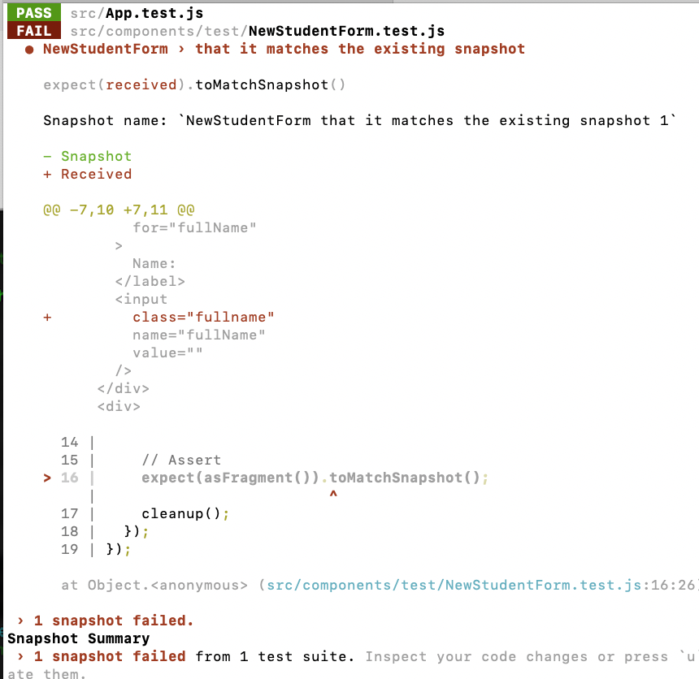
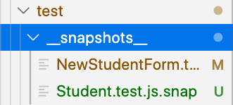

# Testing React Components

Here we will try to ensure that individual components work predictably by testing for unexpected changes to UI and how users interact with our components.  We will introduce two forms of testing unlike any we have done with Ruby, Snapshot testing & testing user interfaces.

## Learning Goals
By the end of this lesson you should be able to:
- Explain the terms _Snapshot Test_, and _shallow_ and _deep_ rendering
- Write tests to verify components exist and actions perform as expected

## Getting Started

In this lesson we will be learning testing through the React pets project we worked on earlier.

You can clone the repository [here](https://github.com/AdaGold/react-pets), and switch to the `solution` branch, if needed.

Once you have cloned the repository remember to run `npm install` to install the project dependencies.

## How to Run Tests

Create-react-app comes with Jest testing built in and in fact provides an initial test.  To run the test type:  `npm test` and you will get a screen like this:
```bash
No tests found related to files changed since last commit.
Press `a` to run all tests, or run Jest with `--watchAll`.

Watch Usage
 › Press a to run all tests.
 › Press p to filter by a filename regex pattern.
 › Press t to filter by a test name regex pattern.
 › Press q to quit watch mode.
 › Press Enter to trigger a test run.
 ```

The test-runner will automatically run tests which have changed since the last save.  As you develop a React application, you can leave the tests running in a terminal tab and the tests will re-execute when you save files.

  **Press `a` now** to manually re-run all the existing tests.

 You should get the following:
 ```bash
 PASS  src/App.test.js
 ✓ renders without crashing (25ms)

Test Suites: 1 passed, 1 total
Tests:       1 passed, 1 total
Snapshots:   0 total
Time:        1.074s
Ran all test suites.

Watch Usage: Press w to show more.
```

Notice it ran a test named `renders without crashing` in the `src/App.test.js` file.

Open that file:

```javascript
// src/App.test.js

import React from 'react';
import ReactDOM from 'react-dom';
import App from './App';

it('renders without crashing', () => {
  const div = document.createElement('div');
  ReactDOM.render(<App />, div);
  ReactDOM.unmountComponentAtNode(div);
});
```

The test manually creates a `div` element and embeds the `App` component within it.

Add a `  console.log(div.innerHTML);` after the `ReactDOM.render` command and look at what is output in the test window.

**Question**  What do you notice?

The default test in `App.test.js` first creates a `div` element which is **not** embedded in any webpage and then embeds an instance of the App component inside the `div`.  In this way it tests that the component can be rendered at all.  Lastly `ReactDOM.unmountComponentAtNode` destroys the instance to save memory.

This test doesn't actually make any assertions, there are no `expect(div).toBe(y)` commands, but it ensures that the component will show up on the screen without crashing React.

### Installing Enzyme & React Test Renderer

Enzyme is a handy library which will make it easier to manipulate, traverse and make assertions on our React components.  It's made to work similar to jQuery for selecting, rendering and manipulating the DOM.

To install enzyme for testing your application, execute from the terminal:

```bash
npm i --save-dev enzyme enzyme-adapter-react-16 enzyme-to-json
```

**Note** This will install enzyme and an adapter or version 16 of React.  You can expect a new adapter for later versions of React.

Next we need to tell Jest how to serialize enzyme data. Open up `package.json` and add the following object:

```json
{
  "jest": {
    "snapshotSerializers": ["enzyme-to-json/serializer"]
  }
}
```

Finally, tell Jest how to configure enzyme and use the adapter.  Create the file `src/setupTests.js` and add the following content.

```javascript
// src/setupTests.js
import { configure } from 'enzyme';
import Adapter from 'enzyme-adapter-react-16';

configure({ adapter: new Adapter() });
```

This file is run when you start testing with create-react-app and allows us to tell enzyme which adapter to use.  If you have tests running you will need to exit and restart Jest.

## Snapshot Testing

### What is it?

With React we often want to ensure that a component is rendering properly.  For our `NewPetForm` component we could write tests ensure that all the fields are rendering through tests that:

1.  Ensure that the component renders 4 input fields.
2.  Each field is labeled properly.
3.  Ensure there is a submit button
4.  and more and more and more...

However these tests are pretty fragile, easy to break when you make minor changes to the form and tedious to update for UI refactoring.

Instead we can:
1.  Convert the rendered html of the component into JSON with the JSON holding the most significant features of the component.
2.  Save that JSON to a "Snapshot" file.
3.  Compare future runs of the test to that snapshot and alert the user to any changes.

When a component changes, we can be alerted and make corrections, or update the snapshot for future test runs.

**Question:** Can you do TDD with a Snapshot test?

### Creating our First Snapshot

Lets create a snapshot test for one of our untested components, `NewPetForm`.

First create `src/NewPetForm.test.js`

```javascript
// src/NewPetForm.test.js
import React from 'react';
import NewPetForm from './NewPetForm';
import { mount } from 'enzyme';

describe('NewPetForm', () => {
  test('that it matches an existing snapshot', () => {
    // First Mount the Component in the testing DOM
    // Arrange
    const wrapper = mount( <NewPetForm addPetCallback={() => {} } />);

    // Assert that it looks like the last snapshot
    expect(wrapper).toMatchSnapshot();

    // Remove the component from the DOM (save memory and prevent side effects).
    wrapper.unmount();
  });
});
```
Now lets break the test.  Modify the `NewPetForm` component by adding a class attribute to one of the elements.  You should see something like this:



This is called a shapshot diff.  Notice the added content are highlighted in red with a `+` sign.  You can update the snapshot with the `u` key.  Update the snapshot now.

**Question:** After updating the snapshot take out the class name.  What does the snapshot diff look like now?

**Exercise** Create a test file and a test for the `Pet` component.

You can see a solution on the testing branch of the repository.

In the above example we used Enzyme's `mount` function to create the snapshot.  You can read about `mount` in Enzyme's documentation [here](https://airbnb.io/enzyme/docs/api/mount.html).  Using `mount` renders a component including any subcomponents fully in a virtual DOM.  Because it mounts the component in the DOM, it is important to call `.unmount` at the end of every test to prevent one test from affecting another.

### Snapshots Files

You may wonder, "Where are these snapshots saved?"  You can see the snapshot file in your components folder.



**Question** What does the snapshot file look like?

Notice that the snapshot file looks a lot like the JSX rendered by the component, but it's a generated JSON file making it easier to compare to new snapshots.  You generally won't need to look at these files directly, but looking at the snapshot file should help you understand how Jest compares the current snapshot to the rendered content from the test.


### Creating a Shallow Snapshot with enzyme

This type of snapshot can work just fine for small components without subcomponents.  However with a complicated container component with dozens of subcomponents the snapshot can be thousands of lines long.  It would also be very fragile.  Any time one subcomponent changed, the snapshot would fail with an enormous diff.  A test that fails too often and is hard to parse gets ignored becoming useless.  **Snapshot test files should as a rule be as small as practical and specific to the component being tested**.

To keep snapshot files smaller we can engage in **shallow rendering**.

### Shallow Rendering

Enzyme has two methods of rendering a component for testing.  Add the following two tests and look at the resulting Snapshot files.

```javascript
// src/App.js
import React from 'react';
import ReactDOM from 'react-dom';
import { mount, shallow } from 'enzyme';
import App from './App';

describe('<App />', () => {

  test('will match the last snapshot with deep rendering', () => {
    const wrapper = mount(<App />);
    expect(wrapper).toMatchSnapshot();
  });

  test('that it renders App with shallow rendering', () => {
    const wrapper = shallow(<App />);
    expect(wrapper).toMatchSnapshot();
  });
});
```

**Question** Run the above two tests.  What do you notice about the differences in the two Snapshots?

The `mount` function, as we have seen fully mounts a component and all subcomponents in the DOM.  Enzyme has another function called `shallow` which will render a component with placeholders for subcomponents.

So if we shallowly rendered `App`, it would render `<NewPetForm />` in place of the fully rendered html the `NewPetForm` component generates.  Using this technique you can limit snapshot changes to the component you are testing.

The following two tests show deep and shallow rendering in snapshot tests.

**Question** If we have a shallow snapshot of `App`, how do we get alerted when `Pet` changes?

**So why would you ever use `mount`?**

Use `mount` when you need to test the interaction between a container and child component.  Otherwise for unit testing use `shallow` almost exclusively.  You should **avoid** using `mount` for snapshot testing.

| Enzyme Function | Used for |  Description |
| ------ | ------ | ----- |
|  mount  |  Deep Rendering | Renders the entire component and subcomponent to test their interactions  |
|  shallow  |  shallow rendering  | Used for tests on a single component in isolation.

## Testing User Interaction

With snapshot testing we have tested how React components **render** to the DOM.  Next we need to test how the components respond to user interaction.

```javascript
// src/components/NewPetForm.test.js
...
test('when the user enters a name in the text field, the field is updated', () => {
  // Arrange
  // Shallow-mount the wrapper
  const wrapper = shallow( <NewPetForm addPetCallback={() => {}} />);
  // Find the input in the component
  let nameField = wrapper.find('input[name="name"]');

  // Act
  // Trigger a 'change' event
  nameField.simulate('change', {
    target: {
      name: 'name',
      value: 'Bob',
    },
  });
  // Force the component to update (setState is async)
  wrapper.update();
  // Find the updated component
  nameField = wrapper.find('input[name="name"]');

  // Assert
  expect(nameField.getElement().props.value).toEqual('Bob');
});
```

The Above test first shallowly renders the form, and then finds the input for the `name` field.  With the `find` method you can select elements just like using jQuery.  It returns a [`ShallowWrapper`](http://airbnb.io/enzyme/docs/api/shallow.html) object to enclose the input and then we trigger a `change` event on the field with  the `simulate` function.

Because `setState` is asynchronous, Enzyme provides an `update` function to force the component to update its state, and then we can test the new value of the `name` input field.

You may also notice that we have `nameField.getElement().props.value` to get the value of the HTML element.  In this case Enzyme can return the HTML properties.  Enzyme shallow copies treat all properties both among HTML elements or React components.

**Exercise** Add tests to verify the `change` events for the other input fields.  There are two ways to do this, either add 3 separate tests, or create a loop to iterate through the fields.  You can see the second solution [here](https://github.com/AdaGold/react-pets/blob/testing/src/components/NewPetForm.test.js).

### Testing Submit Actions and Callbacks

When the user submits the NewPetForm we expect it to call the `addPetCallback` prop.  To test this we can use a feature of Jest called a [Mock Function](https://facebook.github.io/jest/docs/en/mock-functions.html).

```javascript
test('addPetCallback prop is called when the form is submitted', () => {
  // Arrange
  const mockAddPetCallback = jest.fn();
  const wrapper = shallow(<NewPetForm addPetCallback={mockAddPetCallback} />);
  const form = wrapper.find('form');

  // Act
  form.simulate('submit', {
    preventDefault: () => {},
  });
  wrapper.update();

  // Assert
  expect(mockAddPetCallback).toHaveBeenCalled();
  expect(mockAddPetCallback.mock.calls[0][0]).toEqual({
    name: '',
    age: '',
    breed: '',
    about: '',
  });
});
```

The line `const mockAddPetCallback = jest.fn();` creates a function which we can use to capture calls and verify if a callback has been executed.

Using this technique we can test a component and verify that a callback function passed as a prop is called when an event occurs.

We can verify the function was called with the expectation `toHaveBeenCalled`.

We can also verify the arguments sent to the callback function with: `mockAddPetCallback.mock.calls`.  `mockAddPetCallback.mock.calls` returns a 2-dimensional array of calls against the function and arguments sent to it.  So `mockAddPetCallback.mock.calls[0][0]` returns the first argument sent to the function the first time it was called.  `mockAddPetCallback.mock.calls[1][2]` meanwhile would indicate the 3rd argument sent to the function the second time it was called.

## Unit Testing User Interation - What To Test

We have looked at what to test.  _What_ should you test?  In general if a Component has state that changes with user interaction, you should test to verify that it responds as expected.

When testing the `NewPetForm`, the Component should respond to two kinds of user interaction.

1.  When the user types in a field, the state should be updated and the field's value should be updated.
2.  When the form is submitted, it should call the function passed into the `addPetCallback` prop with the proper parameters.

### Going Further

Another test we could write would enable us to test what happens to the `PetsCollection` when the user submits the form?

**Question**:  Could you do this with a shallow render of the form?  How would you write this test?

## Summary

In this lesson we learned what a snapshot test is and how to create one.  We then saw how to test a React component and verify that it responds properly to events.

## Resources
- [Tutorial on Testing React](https://medium.com/tribalscale/tutorial-on-testing-react-part-1-2c587e39114d)
- [The Right way to test React Components](https://medium.freecodecamp.org/the-right-way-to-test-react-components-548a4736ab22)
- [Jest Documentation - Testing React Apps](https://facebook.github.io/jest/docs/en/tutorial-react.html)
- [Using Jest with enzyme](https://github.com/airbnb/enzyme/blob/master/docs/guides/jest.md)
