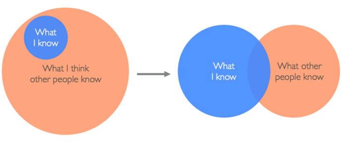

# Imposter Syndrome

## Learning Goal
To learn more about Imposter Syndrome

## Watch:
+ she++ The Documentary - Good Girl Gone Geek
+ https://www.youtube.com/watch?v=DqrfPCGo2aQ
+ Feel Like You're Faking It? That Might Not Be a Bad Thing
http://lifehacker.com/5928639/feel-like-youre-faking-it-that-might-not-be-a-bad-thing
+ RailsConf 2014 - You are Not an Impostor by Nickolas Means (33 mins)
https://www.youtube.com/watch?v=l_Vqp1dPuPo

## Learning Goal
+ Perspective on what you know and what you don't

## Think about this graphic

## SLACK CRYSTAL
+ List 1 of your fears
+ List 1 accomplishment you have made in the last two weeks
+ List 1 thing that makes you awesome (programming aside)
+ (optional) Reflections on Imposter Syndrome
